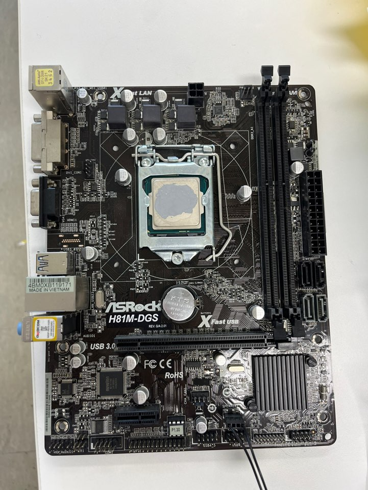
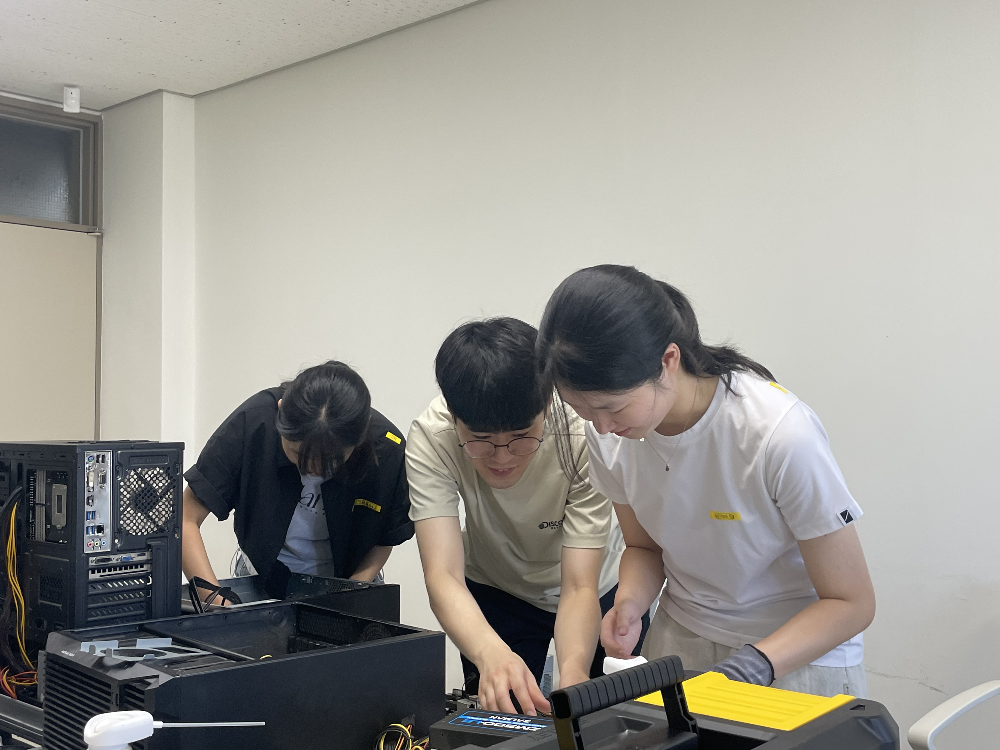

# 1일차

## 활동 내용 & 목표
*활동내용*

- 컴퓨터 본체를 분해 및 조립하였음.

- 라떼판다 조립함.

*목표*

- 컴퓨터 내부 구조와 각각의 부품 이해.

- 컴퓨터 동작 원리 파악.

### 컴퓨터 본체 분해 및 결합

#### 본체뚜껑을 뜯은 상태

#### cd-rom 분해

#### 하드디스크 분해

#### 메인보드 분해

#### cpu 분해

----------

### 라떼판다 조립

#### 라떼판다 조립

