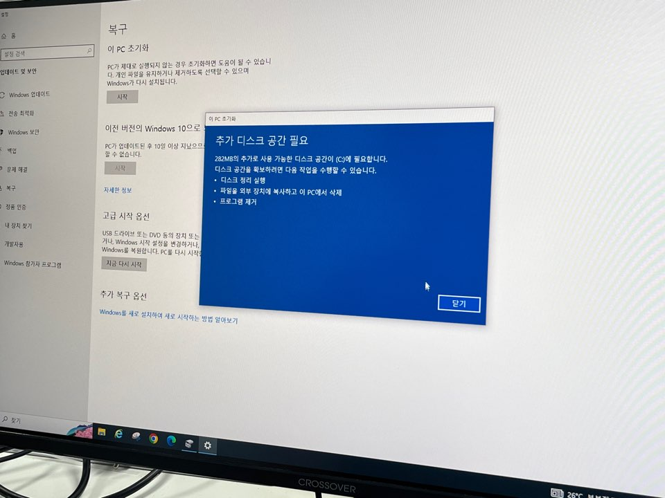
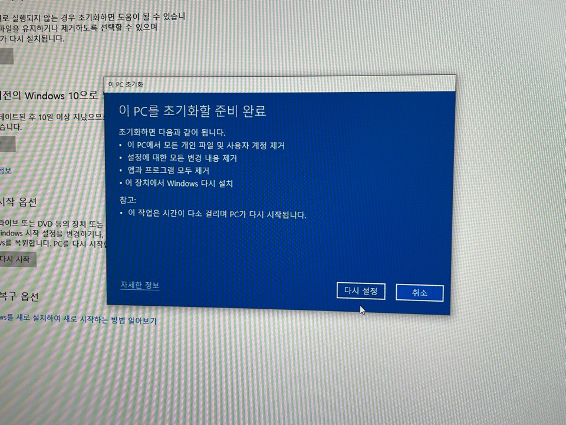
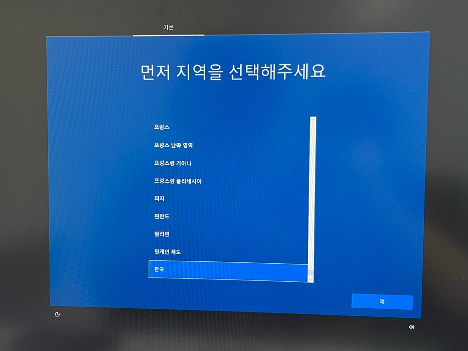
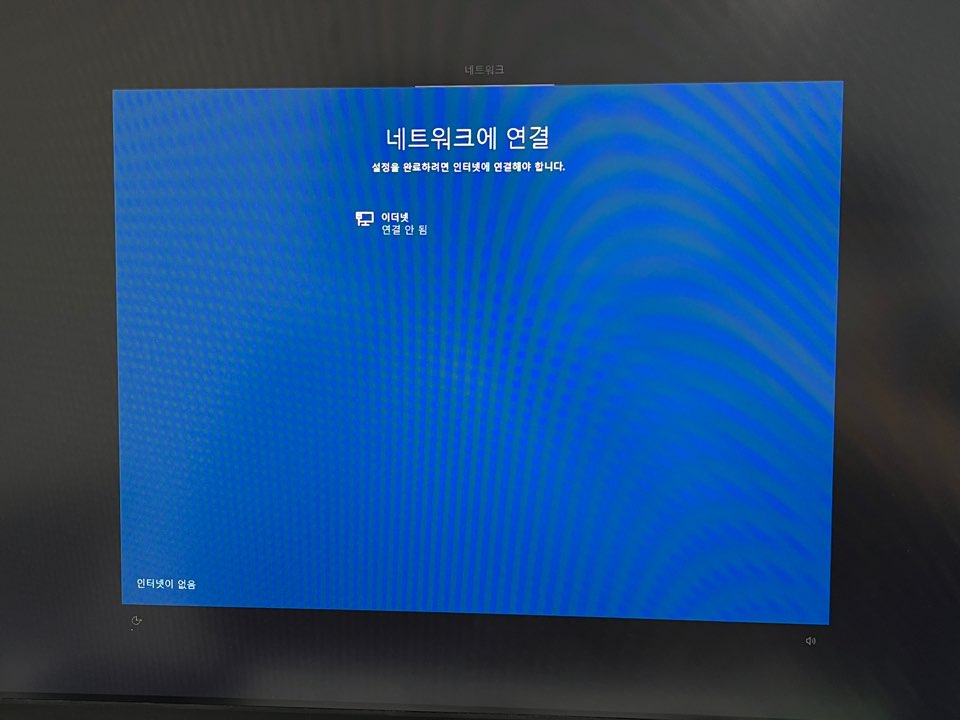
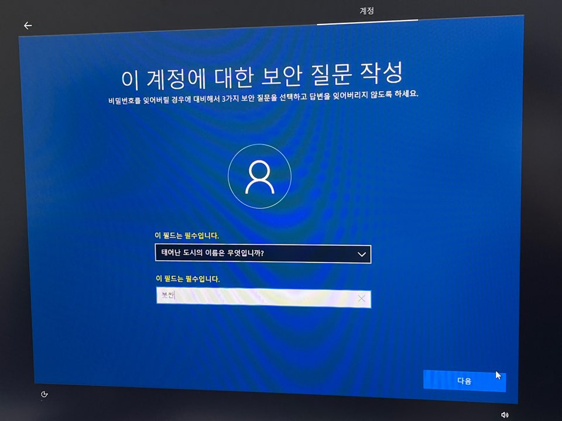
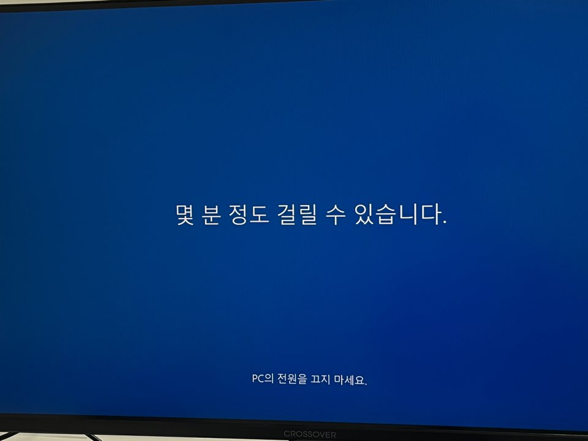
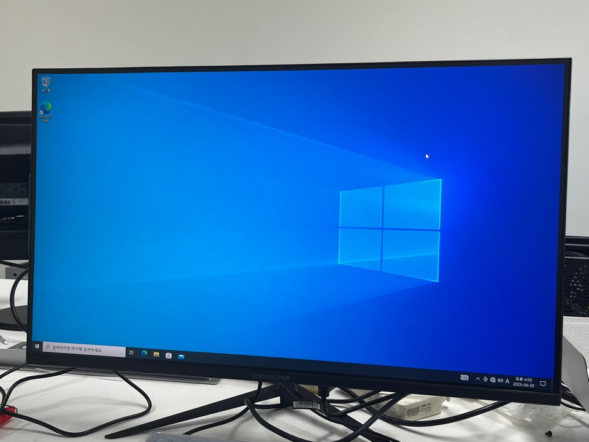
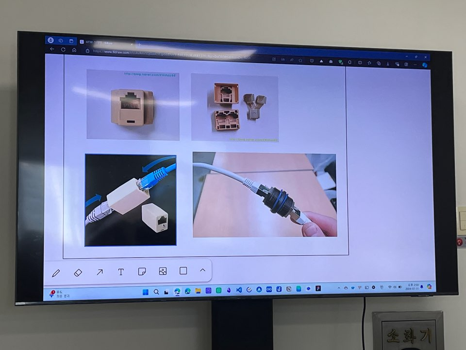
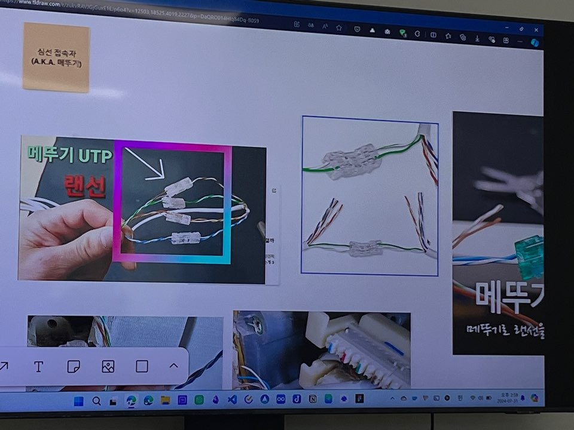
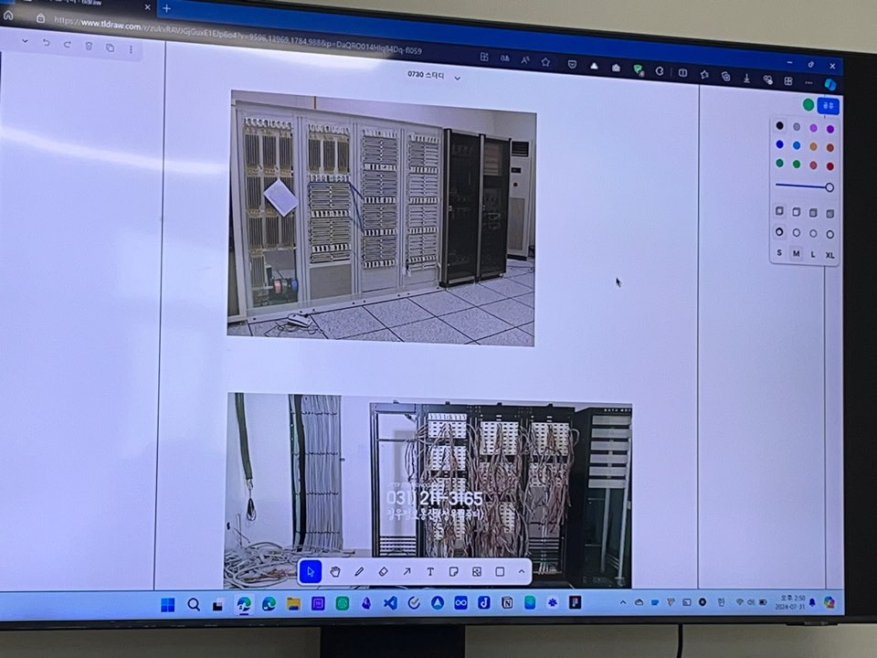

# 2일차

## 라떼판다 조립 및 랜선 제작 / 조립

*활동내용*
- 윈도우 재설치 해보기.
- 미니PC인 라떼판다를 조립함.
- 인터넷 연결 및 실행 후, 기능 테스트를 해봄.
- 랜선의 구조를 이해하고 직접 랜선을 만들어 봄.

*목표*
- 미니PC 구조에대해 알아보고, 매뉴얼에 따라 실행시키기
- 케이블의 종류와 배열을 알아보고 네트워크와 통신에 대해 이해하기

### 윈도우 재 설치

#### 윈도우를 재 설치중인 사진

-------

### 라떼판다: x86 기반의 싱글 보드 컴퓨터

#### 라떼판다 보드와 입/출력 장치를 연결하여 미니PC 조립
(라떼판다 사진 ㅇㅇ)

#### 윈도우 10 기본내장, 내장된 와이파이 안테나로 무선 인터넷 연결
(라떼판다 연결 사진)

#### 부팅 후, 인터넷 접속 확인 / 웹 게임 실행
(라떼판다 웹 게임 실행 사진)

---------

### 각종 이론 / 랜선 조립 실습

#### 이론 학습
- UTP 구조 학습 
  
- 케이블 구조 확인하여 랜선 조립 전 이론 학습 
  
- 간단한 통신과 네트워크 이론 학습 
  

#### 랜선 조립
- 순서 확인 후 랜선 직접 만들어보기
  (사진)
- 만든 랜선으로 인터넷 되는지 해보기
  (사진)
